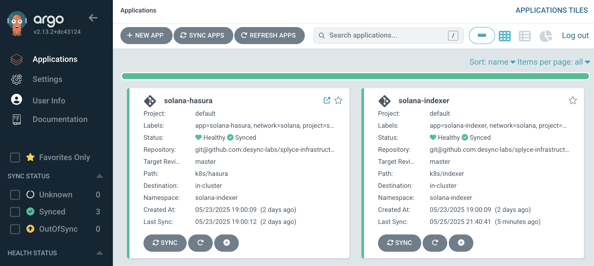

# Proof of Concept: GitOps with Argo CD for AsciiArtify

Цей документ описує процес розгортання GitOps-системи Argo CD на Kubernetes кластері для проєкту **AsciiArtify**.

## Вимоги

- Встановлений Kubernetes кластер (локальний або хмарний)
- `kubectl` налаштований на відповідний кластер
- Доступ до інтернету для завантаження ресурсів Argo CD

## Крок 1: Встановлення Argo CD

Створюємо окремий namespace для Argo CD:

```bash
kubectl create namespace argocd
```

Застосовуємо офіційний манифест для встановлення компонентів:

```bash
kubectl apply -n argocd -f https://raw.githubusercontent.com/argoproj/argo-cd/stable/manifests/install.yaml
```

## Крок 2: Налаштування доступу до графічного інтерфейсу

Для спрощення доступу в PoC-режимі ми відкриємо вебінтерфейс Argo CD через `NodePort`:

### Створюємо Service типу NodePort

Збережіть наступний YAML у файл `argocd/nodeport.yaml`:

```yaml
apiVersion: v1
kind: Service
metadata:
  labels:
    app.kubernetes.io/component: server
    app.kubernetes.io/name: argocd-server
    app.kubernetes.io/part-of: argocd
  name: argocd-server-nodeport
  namespace: argocd
spec:
  type: NodePort
  ports:
    - name: https
      protocol: TCP
      port: 8080
      targetPort: 8080
      nodePort: 30008
  selector:
    app.kubernetes.io/name: argocd-server
```

Застосовуємо його:

```bash
kubectl apply -n argocd -f ./argocd/nodeport.yaml
```

> **Примітка**: Це лише для PoC. У продакшені потрібно використовувати Ingress з TLS.

## Крок 3: Доступ до Argo CD UI

Перейдіть у браузері за адресою:

```
https://<IP-адреса_ноди>:30008
```

> Щоб дізнатися IP-адресу ноди:
```bash
kubectl get nodes -o wide
```

## Крок 4: Авторизація

- **Логін**: `admin`
- **Пароль** (зчитується з Kubernetes секрету):

```bash
kubectl get secret argocd-initial-admin-secret -n argocd -o jsonpath="{.data.password}" | base64 --decode; echo
```

---

> **Рекомендація: Аутентифікація через GitHub (SSO)**:
Для зручного та безпечного доступу до Argo CD рекомендується налаштувати автентифікацію через GitHub OAuth з прив'язкою до вашої організації. Це дозволить членам команди входити в Argo CD через GitHub-акаунти без спільного пароля адміністратора.
Докладніше: [Argo CD — GitHub SSO](https://argo-cd.readthedocs.io/en/stable/operator-manual/user-management/)

## Вхід через GitHub

Після налаштування інтеграції з GitHub на сторінці входу зʼявиться кнопка **"Login with GitHub"**.

1. Натисніть **"Login with GitHub"**
2. Авторизуйте доступ через GitHub (якщо запитає)
3. Після входу ви будете перенаправлені в Argo CD UI з відповідними правами доступу

> Доступ матимуть лише користувачі GitHub-організації, вказаної у конфігурації


## Інтерфейс Argo CD

Після успішного входу ви потрапите до головної панелі Argo CD.

Тут ви можете керувати вашими аплікаціями:
- переглядати їхній стан,
- синхронізувати з репозиторієм,
- застосовувати зміни вручну або автоматично.

Додаткові можливості включають створення нових застосунків, моніторинг подій і управління доступом.



## Посилання

- Офіційна документація Argo CD: https://argo-cd.readthedocs.io/en/stable/